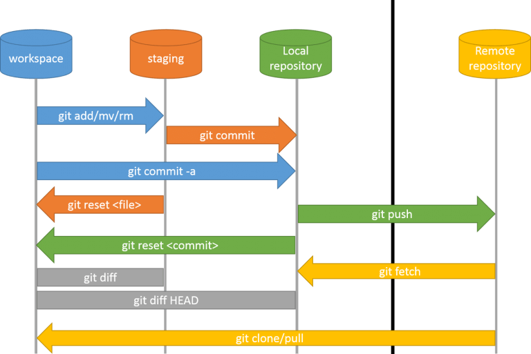

### Домашнее задание 3.14.1 (HW-01) курса PHP-Pro (Skillfactory)

Автор: Александр Климок / [kydechuk01](https://github.com/kydechuk01/)

---

[<<< К оглавлению](./README.md#оглавление) 

### Базовый порядок разработки и схема работы git

* Установка дистрибутива Git на свой ПК ([инструкция](./git_install.md)).

* <u>Вариант А</u> (сначала создается онлайн-репозиторий):
  * Создание репозитория на онлайн-сервере, таком как [**GitHub**](https://github.com) или **GitLab**.
  * Клонирование удаленного репозитория на локальный компьютер -> [`git clone`](./git-clone.md)

* <u>Вариант Б</u> (создается локальный репозиторий, который затем впоследствии можно будет связать с онлайн-репозиторием)  
  * Инициализация репозитория в папке проекта через -> [`git init`](git-init.md) 
  * *(необязательно)* Связывание репозитория с онлайн-версией -> [`git remote add`](git-remote.md) 
  * *(необязательно)* Скачивание удаленного репозитория и объединение его с локальной копией -> [`git pull`](./git-pull.md)
  
* [ ***Работа с проектом*** ]
* Добавление локально измененных файлов проекта в индекс -> [`git add`](./git-add.md)
* Проверка состояния репозитория -> [`git status`](./git-status.md)
* Коммит локальных изменений в репозиторий -> [`git commit`](./git-commit.md)
* Отправка изменений на сервер -> [`git push`](./git-push.md)
* Запрос и применение изменений с сервера -> [`git pull`](./git-pull.md)
* Проверка истории проекта -> [`git log`](.)
* Работа с ветками проекта -> [`git branch`](./git-branch.md)
* Откат изменений в файлах проекта -> [`git checkout`](./git-checkout.md)
  
 

### Схема жизненых циклов git-проекта

Что происходит на отдельных этапах работы с git-проектом можно понять, изучив данную диаграмму:

 

[< Назад](./README.md#оглавление) 